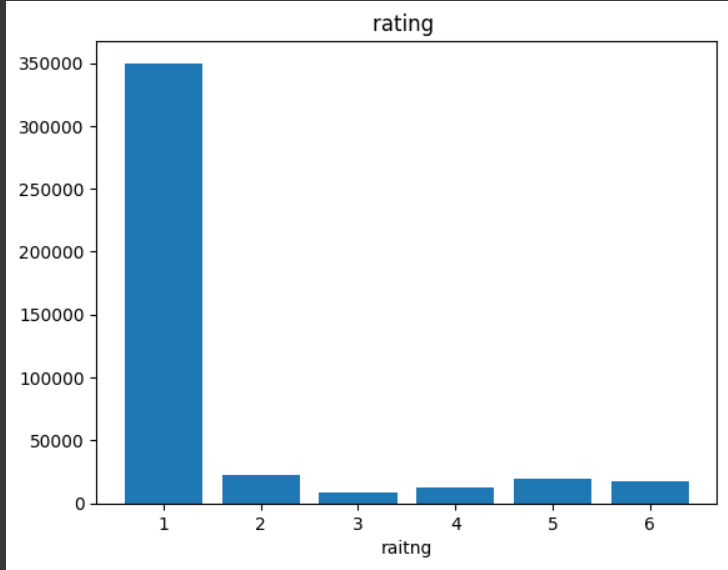
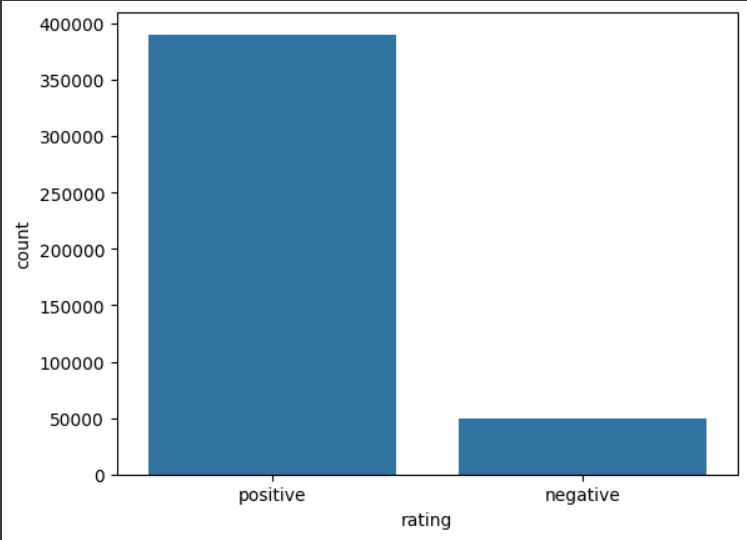
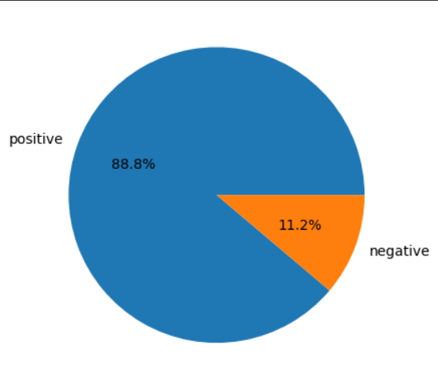
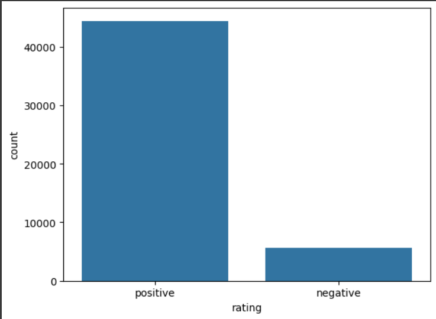
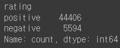
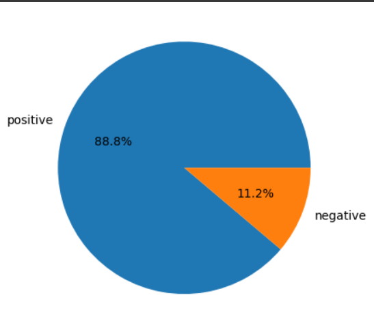

 
# MobileBERT를 활용한 환자 리뷰의 긍,부정 예측

## 1. 개요

### 1.1 의료 서비스의 중요성

의료 기술이 발전함에 따라 환자들의 의료 만족도는 더이상 병원이 제공하는 의료
품질에만 국한되지 않고, 의료 서비스 방면으로 확장되어가고 있다.
[1.참고](https://ir.ymlib.yonsei.ac.kr/bitstream/22282913/137544/1/T005533.pdf)
 앞 참고의 내용을 보면 알다시피 환자가 느끼는
의료 서비스의 수준은 곧 환자의 재방문 의사로 이어짐을 알 수 있다.

이는 의료 수준의 차별성으로는 다른 병원과의 차이를 두드러지게 낼 수 없는 요즘,
점차 의료 서비스의 중요성이 대두되고 있음을 알려주는 지표로써 작용한다. 

### 1.2 프로젝트 목표

위에서 말했듯, 의료 서비스는 점점 대두되고 있다.
그래서 이 프로젝트는 의사에 대한 환자의 리뷰를 입력받고 긍, 부정데이터로 나눈
뒤 다른 환자의 리뷰를 입력했을 때
그 리뷰가 긍정일지 부정일지 예측해보는 코드를 짜 실행해보고자 한다.
이 프로젝트를 진행함으로써 기대할 수 있는 이점은 이와같다.

-  환자 리뷰의 긍, 부정을 예측해 환자의 의견 및 평가를 빠르게 예측할 수 있다.
-  부정적 리뷰의 내용을 분석해 이를 토대로 의료서비스를 개편해감으로써 더 나은 서비스 품질을 기대 할 수 있다.
-  환자들의 리뷰를 분석하고 이해하며 의료진과 환자와의 의사소통을 보다 원활히 할 수 있다.

## 2.원시 데이터

### 2.1 데이터 구성

[Patient Reviews 데이터셋](https://www.kaggle.com/datasets/thedevastator/german-2021-patient-reviews-and-ratings-of-docto?resource=download)

- 데이터명

  
|index|rating| comment |
|-----|------|---------|
| 색인 | 평가 | 리뷰 |
- 데이터 예시

  
| index | rating | comment |
|--------|--------|---------|
| 0 | 2.0 |Ich bin franzose und bin seit ein paar Wochen inmuenchen. Ich hatte Zahn Schmerzen und mein Kollegu...|
| 1 | 6.0 |Dieser Arzt ist das unmöglichste was mir in meinem Lebenje begegnet ist,er ist unfreundlich ,sehr h...|
| .. |...|...|
| 439278 | 1.0 |Prof. Herbort hat mein vorderes KB sehr gut operiert.Gute Aufklärung (welche Sehne wird genommen), ...|
| 439279 | 1.0 |Beste Kompetenz. Vertrauensverhältnis von Beginn an sehrhoch. Erklärung 1a. &lt;br /&gt; 100% Zufriedenhe...|

## 2.2 데이터 분석

- 총 리뷰의 수

총 리뷰의 수를 알기위해 아래 코드를 실행해보면

~~~
num = len(data["index"])
print("데이터 개수:", num)
~~~

`데이터개수: 439280`

총 리뷰수는 439280 건임을 알 수 있다.

- rating 분포   

 

환자의 의사에 대한 점수는 1(최상)이 약 350000건, 나머지 점수들은 각각 5만건 이하로 측정되었다.

- 긍,부정 예측

 긍, 부정 분리

~~~
data['rating'] = data['rating'].apply(lambda x: "negative" if x>=4.0
                                      else "positive")
~~~
  
 이 프로젝트에서는 rating, 즉 환자의 평점이 4점이상이면 negative, 3점 이하면 positive로 나눠 분석을 진행하였다.

- 시각화
 

 

시각화를 진행한 결과, 긍정 데이터가 약 38만건 부정 데이터는 약 5만건의 데이터가 있음을 알 수 있다.

 

원그래프를 이용해 데이터 분포를 알아본결과 긍정데이터는 약 89퍼센트, 부정데이터는 약 11퍼센트를 차지하고 있음을 알 수 있었다.

## 2.3 데이터 추출

원시 데이터 분석을 끝낸 후, 프로젝트의 목표인 환자 리뷰의 긍,부정 예측을 위해 기존 원시데이터에서 학습을 위한 데이터로 5만건의 데이터를 랜덤으로 추출하였다.

~~~
import random
new_df = data.sample(n = 50000, random_state = 42)
~~~

### 추출 데이터 분석

**긍, 부정 분포**

- 분포 시각화

 

추출 데이터의 긍, 부정 분포를 시각화한 결과 긍정 데이터가 약 4.5만건, 부정데이터가 약 5천건 정도 있는 것으로 보인다.

- 분포 수

 

보다 더 정확한 분포를 알기 위해 수를 세어본 결과 긍정데이터가 44406, 부정데이터가 5594건이 있는 것으로 나타난다.

- 분포도

 

마지막으로 긍, 부정데이터의 분포도를 보기 쉽게 원그래프를 이용해 확인한 결과 긍정데이터는 약 89퍼센트, 부정데이터는 약 11퍼센트가 있음을 알 수 있다.

